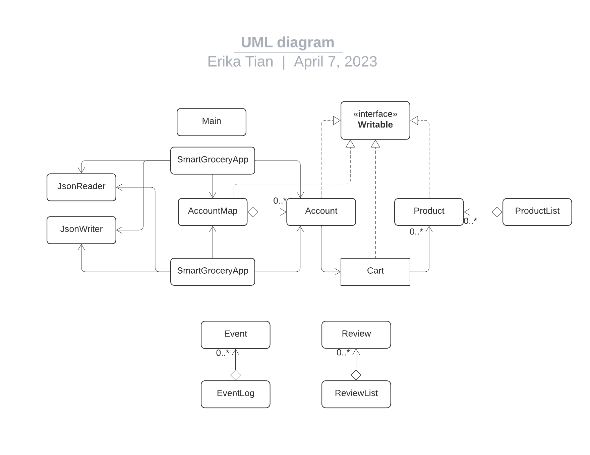

# SmartGroceryManager

## A Grocery Management System

This application allows users to ***view*** all products in a grocery store, ***add*** items in the shopping cart and ***purchase*** all selected products. Potential users will mainly include ***everyone*** in the daily life. As this project progresses, an owner portal may be constructed too, thus potential users may also include owners who run this grocery store. The ***reason*** why I am interested in this project is that I feel buying groceries could be tedious and time-consuming sometimes, so the adoption of a well-established grocery management system could make this process more convenient and benefit the public.     

## User Stories

- As a user, I want to view the list of all products in the grocery store
- As a user, I want to be able to select a product and view the details, including its price, best-before date, etc.
- As a user, I want to be able to ***add*** a product (with its quantity) to the shopping cart in my account
- As a user, I want to be able to ***remove*** a product from the shopping cart in my account
- As a user, I want to be able to top up the balance of my account
- As a user, I want to be able to purchase selected products in the shopping cart in my account
- As a user, I want to be able to select a product and add a new review for it, *for example*, "Good quality!"
- As a user, when I select the quit option from SmartGroceryApp's menu, I want to be reminded to save my grocery list to file and have the option to do so or not
- As a user, when I start SmartGroceryApp, I want to be given the option to load my grocery list from file. 

# Instructions for Grader--Phase 3

- You can generate the first required action related to adding products to a cart by clicking "View all items in the grocery store" on the main menu, and then selecting the product that you want, and clicking "Add to cart". When a window pops up, you can enter the quantity (integer) and then click "OK". The product will be added to the cart (current account). 
- You can generate the second required action related to removing products from a cart by clicking "View the cart" on the main menu, and clicking "Remove an item". When a window pops up, you can enter the name of product that you want to remove and then click "OK". The product will be removed from the cart (current account). Note that the name of product that you enter must be accurate. 
- You can locate my visual component by running the "SmartGroceryGUI". A splash window will appear with welcome greeting to users.
- You can save the state of my application by clicking "Save your account" on the main menu.
- You can reload the state of my application by clicking "Load your account" on the main menu, and clicking "Search" after entering your name. If you don't have existing account, tha App will remind you that "You have no existing account."

# Phase 4: Task 2
### Examples when running "Main" (console-based UI):

Thu Apr 06 22:05:47 PDT 2023
User added $100.0 to the account.

Thu Apr 06 22:06:05 PDT 2023
Apple was added with a quantity of 1.

Thu Apr 06 22:06:17 PDT 2023
Elephant Instant Noodle was removed by user.

### Examples when running "SmartGroceryGUI":

Thu Apr 06 22:12:00 PDT 2023
Elephant Instant Noodle was added with a quantity of 100.

Thu Apr 06 22:12:26 PDT 2023
Purdy's Chocolate Box was removed by user.

Thu Apr 06 22:12:47 PDT 2023
Apple was added with a quantity of 32.

Thu Apr 06 22:13:00 PDT 2023
Apple was added with a quantity of 19.

Thu Apr 06 22:13:17 PDT 2023
Elephant Instant Noodle was removed by user.

Thu Apr 06 22:13:25 PDT 2023
Purdy's Chocolate Box was added with a quantity of 1.

# Phase 4: Task 3 (UML & Refactoring/Design Ideas)

### Refactoring/Design:
- This is idea1
- This is idea2
- This is idea3
- This is idea4
- This is idea5
- This is idea6